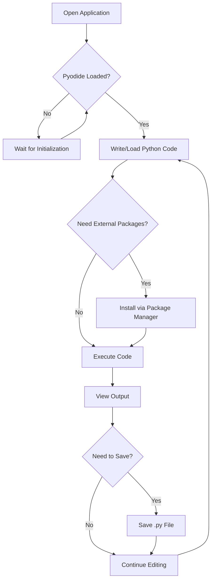
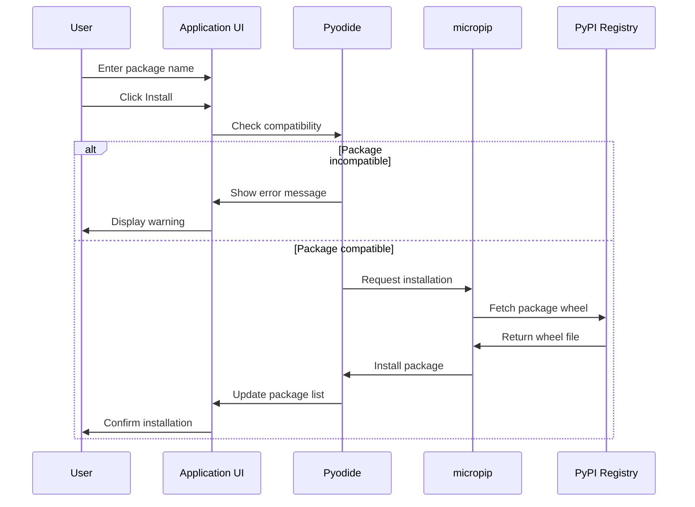
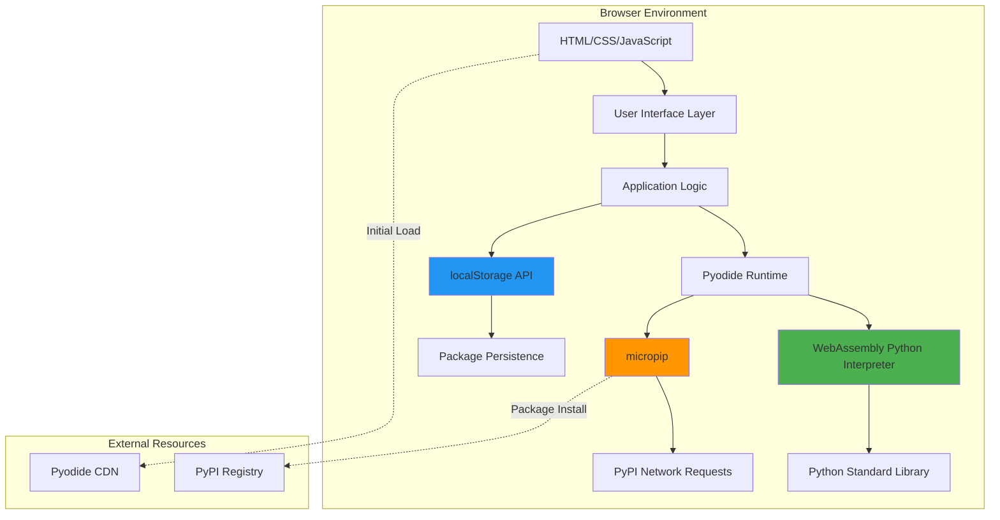

# xsukax Python Web Runner

<div align="center">


**A professional, browser-based Python interpreter powered by WebAssembly**

[Live Demo](https://xsukax.github.io/xsukax-Python-Web-Runner/) • [Report Bug](https://github.com/xsukax/xsukax-Python-Web-Runner/issues) • [Request Feature](https://github.com/xsukax/xsukax-Python-Web-Runner/issues)

</div>

---

## 📋 Project Overview

**xsukax Python Web Runner** is a sophisticated, single-file web application that enables users to write, execute, and manage Python code directly within their web browser. Built on top of Pyodide—a WebAssembly-compiled Python interpreter—this tool eliminates the need for server-side infrastructure, Python installations, or complex development environments.

The application provides a complete Python development experience with an integrated code editor, package manager, and output console. It supports the installation of pure-Python packages from PyPI via `micropip`, offering developers and learners a zero-configuration Python environment accessible from any modern web browser.

### Primary Use Cases

- **Educational Purposes**: Ideal for teaching Python programming without installation overhead
- **Quick Prototyping**: Test Python snippets and algorithms instantly
- **Portable Development**: Access a Python environment from any device with a browser
- **Data Analysis**: Run data science code with libraries like NumPy, Pandas, and Matplotlib
- **API Testing**: Execute HTTP requests and test API interactions using libraries like `requests`
- **Offline Development**: Work on Python projects without internet connectivity (after initial load)

---

## 🔒 Security and Privacy Benefits

xsukax Python Web Runner is architected with security and privacy as foundational principles. The application implements a **zero-trust, client-side execution model** that ensures complete data sovereignty and user privacy.

### Core Security Features

#### 1. **Complete Client-Side Execution**
All Python code execution occurs entirely within the user's browser sandbox using WebAssembly. No code, data, or execution results are transmitted to external servers, ensuring that sensitive information never leaves the user's device.

#### 2. **No Backend Infrastructure**
The application operates as a single HTML file with no server-side components, eliminating potential attack vectors such as:
- Server-side code injection
- Database breaches
- Man-in-the-middle attacks on server communication
- Unauthorized data logging or analytics collection

#### 3. **Browser Sandboxing**
Pyodide runs within the browser's WebAssembly sandbox, which provides:
- Memory isolation from other browser tabs and processes
- Restricted filesystem access
- Limited network capabilities (only explicit user-initiated requests)
- Protection against arbitrary system-level operations

#### 4. **Transparent Source Code**
As a single-file HTML application, the entire source code is visible and auditable. Users can:
- Inspect all JavaScript and CSS code
- Verify no hidden network requests or tracking
- Host the file locally for complete control
- Modify and customize the application freely

#### 5. **Local Data Persistence**
Installed packages are stored exclusively in the browser's `localStorage`, which is:
- Isolated per origin (domain)
- Not accessible to other websites
- Fully controlled by the user
- Easily clearable through browser settings

#### 6. **No Tracking or Analytics**
The application includes:
- No third-party analytics frameworks
- No telemetry or usage tracking
- No cookies or persistent identifiers
- No external resource loading (except Pyodide CDN)

### Privacy Guarantees

- **Data Residency**: All user data remains on the local device
- **Network Isolation**: No automatic network requests except for Pyodide initialization and package installation
- **User Control**: Users have complete control over code execution and package installations
- **Auditability**: Open-source codebase allows independent security verification

---

## ✨ Features and Advantages

### Key Features

#### Code Development
- **Full-Featured Editor**: Syntax-highlighted textarea with monospace font and line wrapping
- **File Operations**: Load `.py` files from disk or save your work as Python scripts
- **Drag-and-Drop Support**: Drop Python files directly onto the editor for instant loading
- **Example Code**: Pre-loaded examples demonstrate common usage patterns

#### Python Execution
- **Dual Execution Modes**:
  - **Standard Run**: Synchronous execution for regular Python code
  - **Async Run**: Support for `async`/`await` syntax and asynchronous operations
- **Real-Time Output**: Live stdout/stderr capture in a dedicated console
- **Error Handling**: Comprehensive error messages with full stack traces
- **Execution Control**: Interrupt capability with refresh-based termination

#### Package Management
- **PyPI Integration**: Install packages directly from the Python Package Index
- **Popular Packages**: Quick-select dropdown with commonly used libraries
- **Persistent Storage**: Installed packages automatically reinstall on page refresh
- **Package Visibility**: View all installed packages with individual removal options
- **Compatibility Checking**: Built-in validation prevents installation of incompatible packages

#### User Interface
- **GitHub-Inspired Design**: Professional, clean aesthetic following modern design patterns
- **Responsive Layout**: Optimized for both desktop and mobile devices
- **Custom Modals**: Non-intrusive confirmation dialogs instead of browser alerts
- **Status Indicators**: Real-time feedback on Pyodide loading and execution state
- **Output Management**: Copy, download, or clear output with auto-scroll capability

### Competitive Advantages

| Feature | xsukax Python Web Runner | Traditional Python IDEs | Other Online Runners |
|---------|-------------------------|------------------------|---------------------|
| **Zero Installation** | ✅ Single HTML file | ❌ Complex setup | ⚠️ Requires account |
| **Offline Capability** | ✅ After initial load | ✅ Yes | ❌ Server-dependent |
| **Privacy** | ✅ No data transmission | ✅ Local only | ❌ Code sent to servers |
| **Package Support** | ✅ PyPI via micropip | ✅ Full pip | ⚠️ Limited selection |
| **Cross-Platform** | ✅ Any browser | ⚠️ OS-dependent | ✅ Web-based |
| **Deployment** | ✅ Single file | ❌ Full installation | ⚠️ Subscription-based |
| **Open Source** | ✅ GPL v3 | ⚠️ Varies | ⚠️ Proprietary |

---

## 🚀 Installation Instructions

### Prerequisites

- A modern web browser with WebAssembly support:
  - Google Chrome 57+
  - Mozilla Firefox 52+
  - Safari 11+
  - Microsoft Edge 16+
  - Opera 44+

### Installation Methods

#### Method 1: Direct Download (Recommended)

1. **Download the HTML file**:
   ```bash
   wget https://raw.githubusercontent.com/xsukax/xsukax-Python-Web-Runner/main/index.html
   ```
   
   Or manually download from: [https://github.com/xsukax/xsukax-Python-Web-Runner](https://github.com/xsukax/xsukax-Python-Web-Runner)

2. **Open the file**:
   - Double-click `index.html` to open in your default browser
   - Or right-click → "Open with" → Select your preferred browser

3. **Wait for initialization**:
   - Pyodide will download automatically (first run only)
   - Status indicator will show "Ready" when complete

#### Method 2: Clone Repository

```bash
# Clone the repository
git clone https://github.com/xsukax/xsukax-Python-Web-Runner.git

# Navigate to the directory
cd xsukax-Python-Web-Runner

# Open the application
open index.html  # macOS
xdg-open index.html  # Linux
start index.html  # Windows
```

#### Method 3: GitHub Pages (Online)

Access the hosted version directly at:
```
https://xsukax.github.io/xsukax-Python-Web-Runner/
```

#### Method 4: Local Web Server (Optional)

For development or testing purposes:

```bash
# Using Python 3
python -m http.server 8000

# Using Node.js
npx http-server -p 8000

# Then navigate to http://localhost:8000
```

### Verification

After opening the application, verify successful installation:

1. Status indicator displays "Ready" with green checkmark
2. Console shows "✓ micropip loaded"
3. Code editor is responsive and accepts input
4. Run button executes the default welcome code

---

## 📖 Usage Guide

### Basic Workflow



### Step-by-Step Instructions

#### 1. Writing Python Code

**Basic Example**:
```python
# Simple calculation
numbers = [1, 2, 3, 4, 5]
total = sum(numbers)
average = total / len(numbers)

print(f"Total: {total}")
print(f"Average: {average}")
```

**Loading Code from File**:
- Click **"Load .py"** button
- Select a Python file from your computer
- Code appears in the editor automatically

**Drag-and-Drop**:
- Drag a `.py` file from your file explorer
- Drop it onto the editor area
- File contents load instantly

#### 2. Executing Code

**Standard Execution**:
- Click **"▶ Run"** for synchronous code
- Output appears in the console below
- Suitable for most Python scripts

**Async Execution**:
- Click **"▶ Run (async)"** for code using `await`
- Required when using `micropip.install()` with `await`
- Enables asynchronous programming patterns

**Example with Async**:
```python
import micropip
await micropip.install('requests')
import requests

response = requests.get('https://api.github.com/users/xsukax')
data = response.json()
print(f"User: {data['login']}")
print(f"Repos: {data['public_repos']}")
```

#### 3. Package Management

**Installation Process**:



**Installing Packages**:

1. **From Input Field**:
   ```
   Type package name → Click "Install"
   Example: requests, numpy, pandas
   ```

2. **From Popular List**:
   - Select from dropdown menu
   - Name auto-fills in input field
   - Click "Install"

3. **From URL**:
   ```
   Enter wheel URL → Click "Install"
   Example: https://example.com/package-1.0-py3-none-any.whl
   ```

**Managing Packages**:
- **View Installed**: Check "Installed Packages" panel
- **Remove Package**: Click "Remove" next to package name
- **Rescan**: Click "Rescan" to refresh package list

**Supported Packages**:
- ✅ Pure Python packages
- ✅ Packages with WASM-compatible wheels
- ✅ NumPy, Pandas, Matplotlib, SciPy
- ✅ requests, httpx, beautifulsoup4
- ❌ GUI libraries (tkinter, pygame, PyQt)
- ❌ System-specific packages (win32, curses)

#### 4. Managing Output

**Output Operations**:
- **Clear**: Remove all output text
- **Copy**: Copy output to clipboard
- **Download**: Save output as `output.txt`
- **Auto-scroll**: Toggle automatic scrolling (default: on)

**Output Types**:
- Regular output: Default color
- Success messages: Green text (✓)
- Warnings: Yellow text (⚠)
- Errors: Red text (✗)

#### 5. Saving Work

**Save Python Script**:
```
Click "Save .py" → File downloads as script.py
```

**Save Output**:
```
Click "Download" in Output panel → Saves as output.txt
```

### System Architecture



### Advanced Usage

#### Custom Package Management

```python
# Install specific version
import micropip
await micropip.install('requests==2.28.0')

# Install from wheel URL
await micropip.install('https://files.pythonhosted.org/...')

# Install multiple packages
await micropip.install(['numpy', 'pandas', 'matplotlib'])
```

#### Error Handling

```python
try:
    import micropip
    await micropip.install('nonexistent-package')
except Exception as e:
    print(f"Installation failed: {e}")
```

#### File Operations in Browser

```python
# Read file content (if uploaded via input)
# Note: Direct filesystem access is limited

# Generate downloadable content
import json

data = {'name': 'xsukax', 'version': '1.0'}
json_str = json.dumps(data, indent=2)
print(json_str)
# Then use Download button to save
```

### Troubleshooting

| Issue | Cause | Solution |
|-------|-------|----------|
| "Pyodide not ready" | Still loading | Wait for "Ready" status |
| Package install fails | No internet / Incompatible | Check network / Try alternative |
| Code doesn't run | Syntax error | Check error message in output |
| "Already running" warning | Previous execution active | Wait or refresh page |
| Packages disappear | localStorage cleared | Reinstall needed packages |

---

## 📄 Licensing Information

This project is licensed under the GNU General Public License v3.0, ensuring it remains free and open-source software.

---

## 🤝 Contributing

Contributions are welcome! Please feel free to submit pull requests or open issues for bugs, feature requests, or documentation improvements.

### Development Setup

1. Fork the repository
2. Clone your fork
3. Make changes to `index.html`
4. Test thoroughly in multiple browsers
5. Submit a pull request with detailed description

---

## 🙏 Acknowledgments

- **Pyodide Team**: For creating the WebAssembly Python runtime
- **Python Software Foundation**: For the Python programming language
- **GitHub**: For hosting and version control infrastructure

---

## 📞 Support

- **Issues**: [GitHub Issues](https://github.com/xsukax/xsukax-Python-Web-Runner/issues)
- **Discussions**: [GitHub Discussions](https://github.com/xsukax/xsukax-Python-Web-Runner/discussions)
- **Documentation**: This README and inline code comments

---

<div align="center">

**Made with ❤️ for the Python community**

⭐ Star this repository if you find it useful!

</div>
